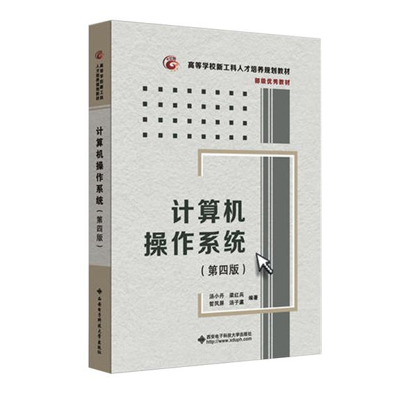

## [《计算机操作系统》](#welcome)期末突击复习知识点整理📚

 

> *我们只为了 **不挂科** 和 **高分** 做准备！*

 

    

 

&emsp;&emsp;💡 教材选自 《计算机操作系统》（第四版） 汤小丹 等编著. 西安电子科技大学出版社, 2014. 

 

    

### 📝 考点罗列整理

>> 温馨提示，以下整理知识点均是以临时抱佛脚复习法所用，同学们还是要以书本内容为主啊！

+ **第一章--操作系统引论 考点**
    
  - [P1-1.1节 OS 的目标与作用](#-OS-的目标与作用)
  
  - [P5-1.2节 OS 的发展过程](#-OS-的发展过程)
  
  - [P14-1.3节 OS 的基本特性](#-OS-的基本特性)
  
+ **第二章--进程的描述与控制 考点**

  - [P39-2.2节 进程的描述](#-进程的描述)
  
  - [P52-2.4节 进程同步](#-进程同步)
  
  - [P65-2.5节 经典进程的同步问题](#-经典进程的同步问题)
  
  - [P81-2.7节 线程（Threads）的基本概念](#-线程Threads的基本概念)
  
+ **第三章--处理机调度与死锁 考点**

  - [P98-3.3节 进程调度](#-进程调度)

  - [P112-3.5节 死锁概述](#-死锁概述)
  
  - [P116-3.6节 预防死锁](#-预防死锁)
  
  - [P119-3.7节 避免死锁（P120利用银行家算法避免死锁）](#-避免死锁)

+ **第四章--存储器管理 考点**

  - [P145-4.4节 对换（Swapping）](#-对换Swapping)
  
  - [P147-4.5节 分页存储管理方式](#-分页存储管理方式)
  
  - [P155-4.6节 分段存储管理方式](#-分段存储管理方式)

+ **第五章--虚拟存储器 考点**

  - [P174-5.3节 页面置换算法](#-页面置换算法)
  
  - [P181-5.4节 “抖动”与工作集](#-抖动与工作集)
  
+ **第六章--输入输出系统 考点**

  - [P202-6.3节 中断机构和中断处理程序](#-中断机构和中断处理程序)
  
+ **第七章 文件管理**

  - [P242-7.2节 文件的逻辑结构](#-文件的逻辑结构)
  
  - [P249-7.3.1节 文件控制块和索引结点](#-文件控制块和索引结点)
  
  - [P255-7.3.4节 目录查询技术](#-目录查询技术)

  - [P257-7.4.1节 基于有向无循环图实现文件共享](#-基于有向无循环图实现文件共享)

  - [P262-7.5.2节 访问矩阵](#-访问矩阵)

+ **第八章 磁盘存储器的管理**

  - [P270-8.1.2节 链接组织方式（隐式链接、显式链接、FAT 技术）](#-链接组织方式)
  
  - [P275-8.1.5节 索引组织方式](#-索引组织方式)
  
 

    
    <h2>第一章 -- 操作系统引论</h2>

    <a href="#-考点罗列整理">返回顶端目录⬆</a>

### 🔍 OS 的目标与作用

### 🔍 OS 的发展过程

### 🔍 OS 的基本特性

 

    
    <h2>第二章 -- 进程的描述与控制</h2>

    <a href="#-考点罗列整理">返回顶端目录⬆</a>

### 🔍 进程的描述

### 🔍 进程同步

### 🔍 经典进程的同步问题

### 🔍 线程（Threads）的基本概念

 

    
    <h2>第三章 -- 处理机调度与死锁</h2>

    <a href="#-考点罗列整理">返回顶端目录⬆</a>

### 🔍 进程调度

&emsp;&emsp;指令（又称机器指令）是指示计算机执行某种操作的命令，是计算机运行的最小功能单元。一台计算机的所有指令的集合构成该机的指令系统，也称指令集。

### 🔍 死锁概述

### 🔍 预防死锁

### 🔍 避免死锁

 

    
    <h2>第四章 -- 存储器管理</h2>

    <a href="#-考点罗列整理">返回顶端目录⬆</a>

### 🔍 对换（Swapping）

### 🔍 分页存储管理方式

### 🔍 分段存储管理方式

 

    
    <h2>第五章 -- 虚拟存储器</h2>

    <a href="#-考点罗列整理">返回顶端目录⬆</a>

### 🔍 页面置换算法

### 🔍 “抖动”与工作集

 

    
    <h2>第六章 -- 输入输出系统</h2>

    <a href="#-考点罗列整理">返回顶端目录⬆</a>

### 🔍 中断机构和中断处理程序

 

    
    <h2>第七章 -- 文件管理</h2>

    <a href="#-考点罗列整理">返回顶端目录⬆</a>

### 🔍 文件的逻辑结构

### 🔍 文件控制块和索引结点

### 🔍 目录查询技术

### 🔍 基于有向无循环图实现文件共享

### 🔍 访问矩阵

 

    
    <h2>第八章 -- 磁盘存储器的管理</h2>

    <a href="#-考点罗列整理">返回顶端目录⬆</a>

### 🔍 链接组织方式

### 🔍 索引组织方式

  

    

 

&emsp;&emsp; 写在最后：大家一起加油吧！ >_<

    <a href="#计算机操作系统期末突击复习知识点整理">返回到文档顶部⬆</a>

 

    -完-

